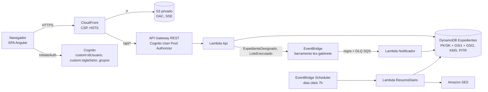

# Design: painel de expedientes do gabinete

## Visão geral



| Pasta | Conteúdo |
| --- | --- |
| `frontend/` | Angular 22 standalone + Bootstrap 5, padrão visual do Único e do protótipo `docs/hackathon-expedientes/Unico — Caixa do Gabinete.html` |
| `backend/` | TypeScript (Node.js 22), zod, Vitest. Três Lambdas (`api`, `notificador`, `resumo-diario`) e um servidor local com a mesma API |
| `infra/` | AWS CDK v2 em TypeScript, uma pilha (`LexGabinete`), `NodejsFunction` com esbuild local |
| `docs/hackathon-expedientes/` | Kit: requisitos, dicionário de dados, seed (`seed/saida/dynamodb/itens.json`) |

A SPA e a API ficam na mesma origem (CloudFront encaminha `/api/*`), então não há CORS.

## Camadas do backend

```text
backend/src
├── dominio/      regras puras, sem I/O (testes unitários)
│   ├── regras.ts        statusPrazo, pontuação com composição, prioridade, risco, recálculo, ordem da fila, chaves GSI
│   ├── criterios.ts     filtros (JSON de filtros_salvos) validados com zod, busca textual, ordenação
│   ├── acesso.ts        setor, sigilo, máscara para tela e para exportação
│   ├── lote.ts          esquema zod do lote, validação por item (prévia) e efeito de cada ação
│   └── designacao.ts    índice de carga e distribuição balanceada
├── dados/        Tabela (interface) → TabelaMemoria | TabelaDynamo; repositorio.ts conhece as chaves
├── eventos/      eventos de domínio, publicador EventBridge, notificador (idempotente)
├── servicos/     painel (contadores, fila), lotes (prévia, execução, desfazer), resumo diário
├── api/          roteador, autenticação, http (zod, erros), formatos (CSV, ICS), handlers finos
├── lambdas/      api.ts (REST proxy), notificador.ts (EventBridge), resumo-diario.ts (Scheduler + SES)
└── local/        servidor HTTP local (tabela em memória carregada do itens.json)
```

## Modelo de dados

Mesmas chaves do `itens.json` (ver `docs/hackathon-expedientes/README.md`). Itens novos seguem o padrão:

| Acesso | Chave | Uso |
| --- | --- | --- |
| Usuário | `PK=USR#<id>`, `SK=PERFIL` | Conferência do usuário autenticado |
| Usuários do setor | `GSI1PK=SETOR#<sigla>`, `GSI1SK` begins `USR#` | Responsável, designação |
| Painel | `GSI1PK=SETOR#<sigla>`, `GSI1SK` begins `ATIVO#[<ger>#]` | Lista, contadores, tela inicial |
| Fila | `GSI2PK=SETOR#<sigla>`, `GSI2SK` begins `PRAZO#` | Modo foco |
| Detalhe | `PK=EXP#<id>` | `META`, `MOV#`, `PRZ#`, `DES#`, `ANO#`, `ROT#` numa só Query |
| Designações ativas | `GSI1PK=USR#<id>`, `GSI1SK` begins `DES#ATIVA#` | Carga por pessoa |
| Alertas, preferências, filtros, lotes | `PK=USR#<id>`, `SK` begins `NOT#`, `PREF#`, `FILTRO#`, `LOTE#` | |
| Lotes do setor | `GSI1PK=SETOR#<sigla>`, `GSI1SK` begins `LOTE#` | Trilha |
| Imagem para desfazer (novo) | `PK=LOTE#<id>`, `SK=UNDO#<seq>` | Estado anterior de cada item alterado |
| Estoque, produtividade, marcadores | `PK=SETOR#<sigla>`, `SK` begins `EST#`, `PROD#`, `ROT#` | Indicadores |
| Informes, catálogos | `PK=NOTICIA`; `PK=CATALOGO#<dominio>` | |

Nenhuma leitura usa `Scan`. Ao gravar um expediente, o repositório recalcula prazo e prioridade e regrava `GSI1SK`
(`ATIVO#…`/`HIST#…`), `GSI2PK` (`SETOR#<sigla>` ou `SETOR#<sigla>#HIST`) e `GSI2SK`. O atributo `versao` do `META`
cresce a cada alteração e protege o desfazer. Os contadores da tela inicial são calculados dos ativos (não de `CONT#`),
para refletir as ações da demonstração.

## Regras de domínio

- `diasRestantes` em dias de calendário no fuso −03:00; `tempoParadoDias` e `diasNoSetor` em dias decorridos (como o
  gerador). Todo ativo é recalculado pela data de referência antes de filtrar e ordenar. Com a referência do seed, os
  contadores batem com `contadores.csv` (teste de API).
- Pontuação, faixas e fila conforme RN1–RN3; a composição sai como `[{motivo, pontos}]` para explicar a prioridade.
- Risco: `null` para vencidos; nulos vão para o fim na ordenação.

### Ações em lote

| Ação | Caixa | Outras condições | Efeito |
| --- | --- | --- | --- |
| RECEBER | A_RECEBER | — | NO_SETOR, `EM_ANALISE`, `dataRecebimento`, MOV `RECEBIMENTO` |
| DESIGNAR | NO_SETOR | autor MEMBRO/CHEFE; destinatário ativo do setor; não repetir o designado | encerra designação ativa, cria `DES#`, MOV `DESIGNACAO`, evento `ExpedienteDesignado` |
| INCLUIR_MARCADOR | NO_SETOR | marcador do setor e do gerenciador; não repetido | `ROT#` + lista `marcadores`, MOV `MARCADOR_INCLUIDO` |
| DAR_CIENCIA | NO_SETOR | JUDICIAL com nova intimação ou `AGUARDANDO_CIENCIA` | `novaIntimacao=false`, MOV `CIENCIA` |
| ASSINAR | NO_SETOR | autor MEMBRO; `AGUARDANDO_ASSINATURA` | `PRONTO_PARA_ENVIO`, minutas = 0, MOV `ASSINATURA` |
| MOVIMENTAR | NO_SETOR | destino informado e diferente do setor | ENVIADO_NAO_RECEBIDO, MOV `ENVIO_PELO_SETOR` |
| ARQUIVAR | NO_SETOR | sem minuta pendente (RN5) | BAIXADO, encerra designação, MOV `ARQUIVAMENTO` |

`POST /api/lotes/previa` analisa sem gravar. `POST /api/lotes` valida de novo, grava cada expediente numa
`TransactWriteItems`, guarda as imagens anteriores e o registro do lote, e publica os eventos. `POST
/api/lotes/{id}/desfazer` só para o autor; restaura os expedientes cuja `versao` não mudou depois do lote. Prévia de
expediente de outro setor devolve só o id e o motivo.

### Designação balanceada

`carga = ativas + 2 × vencidas`; `capacidade = 1 + ações(30 dias) ÷ 30`; `índice = carga ÷ capacidade`. Distribuição
gulosa pelo menor índice, sem devolver o item a quem já é o designado. Candidatos: SERVIDOR ativos do setor.

### Eventos e resumo diário

- `ExpedienteDesignado` → regra do EventBridge → Lambda Notificador (3 tentativas, DLQ SQS) → `NOT#` para o
  designado. O id da notificação deriva da designação: reentregas não duplicam.
- Resumo diário (dias úteis, 7h de Brasília): para quem marcou `notificarPorEmail`, envia por SES vencidos, vencem hoje,
  novos e devoluções vencidas, mais as etiquetas dos próprios prazos. Nunca assunto ou conteúdo. `GET
  /api/resumo-diario` mostra a prévia na tela de alertas.

## API (todas exigem Cognito; nenhuma rota anônima)

| Método e rota | Descrição |
| --- | --- |
| `GET /api/me`, `GET /api/inicio`, `GET /api/resumo-diario` | Usuário e setor, tela inicial, prévia do resumo |
| `GET /api/expedientes` | `gerenciador`, `caixa`, `q`, `criterios` (JSON), `ordenacao`, `pagina`, `tamanho` (10–100) |
| `GET /api/expedientes/exportar`, `GET /api/prazos.ics` | CSV e iCal (sigilosos mascarados) |
| `GET /api/expedientes/{id}`, `GET /api/expedientes/{id}/historico.csv` | Detalhe e histórico (RF13) |
| `GET /api/fila` | Fila do GSI2 (`gerenciador`, `meus`) |
| `POST /api/lotes/previa`, `POST /api/lotes`, `GET /api/lotes`, `POST /api/lotes/{id}/desfazer` | Lotes |
| `GET /api/designacao/sugestao` | Cargas e distribuição sugerida |
| `GET/POST /api/filtros`, `PUT/DELETE /api/filtros/{id}` | Filtros salvos (só o autor altera) |
| `GET/PUT /api/preferencias/{contexto}` | `PAINEL_UNIFICADO`, `INICIO` |
| `GET /api/notificacoes`, `POST /api/notificacoes/lidas` | Alertas |
| `GET /api/indicadores`, `GET /api/catalogos`, `GET /api/usuarios`, `GET /api/marcadores` | Apoio |

Erros: `{erro, mensagem}` com 400 (zod), 401, 403, 404, 405, 409. Corpo até 100 KB; lote até 200 itens.

## Segurança e privacidade

- Cognito com cadastro só pelo administrador; `custom:idUsuario` e `custom:siglaSetor` imutáveis e não graváveis pelo
  cliente; perfil no grupo (`cognito:groups`). A Lambda lê as claims e confere com o cadastro: divergência → 403.
- Toda consulta usa `SETOR#<sigla>` do usuário; detalhe de outro setor → 403.
- RN6 aplicado antes de filtrar (o filtro por assunto não revela o sigiloso). CSV, ICS e e-mail sempre mascarados.
- CSV protegido contra injeção de fórmula. Logs estruturados sem corpo de requisição nem conteúdo de expediente; log de
  acesso do API Gateway sem query string.
- Uma role por Lambda, só com as ações usadas (`grantReadWriteData`, `grantWriteData`, `grantReadData`,
  `events:PutEvents` no barramento, `ses:SendEmail` nas identidades). Teste da pilha garante ausência de `*`.
- DynamoDB com KMS (chave gerenciada) e PITR; S3 privado com OAC, SSE e só HTTPS; CloudFront com CSP, HSTS,
  `X-Frame-Options: DENY`. Throttling no estágio da API.
- Modo local: token HMAC com segredo aleatório por execução; o login local não existe na AWS.

## Frontend

| Rota | Tela |
| --- | --- |
| `/entrar` | Cognito (e-mail e senha) ou seletor de usuário fictício no modo local |
| `/inicio` | Widgets configuráveis: contadores por gerenciador (atalhos para o painel), próximo processo, próximos prazos, alertas, informes, filtros salvos |
| `/painel` | Abas por gerenciador, caixas com contador, busca, filtros avançados, filtros salvos, colunas, densidade, ordenação, paginação, seleção e lote, CSV, ICS |
| `/expedientes/:id` | Prazo e prioridade com composição, risco, dados, prazos, designações, histórico filtrável e exportável, anotações, ações |
| `/foco` | Um por vez na ordem da fila, atalhos N, P, A, X |
| `/alertas` | Central com filtros e marcação de lido; prévia do resumo diário |
| `/indicadores` | KPIs, gráficos em barras com tabela alternativa, produtividade (membro e chefe) |
| `/lotes` | Trilha própria (com desfazer) e do setor |

Acessibilidade: link "pular para o conteúdo", foco visível, foco movido ao conteúdo a cada navegação, `<dialog>`
nativo, `aria-live` e `role="alert"`, tabelas com `caption`/`th id`/`td headers`, `aria-sort`, selos com texto e
símbolo e contraste calculado pela cor do catálogo, áreas de rolagem focáveis. Verificado com axe (WCAG 2.1 AA) em
todas as telas, em desktop e em 390 px.

## Testes

- `backend/test/regras.test.ts`, `lote.test.ts`: RN1–RN5, risco, filtros, sigilo, designação, eventos, resumo.
- `backend/test/api.test.ts`: base completa em memória; 401, 403 (outro setor, claims divergentes), sigilo em lista,
  detalhe, CSV, histórico e ICS, painel sem BAIXADO, contadores = `contadores.csv`, lote ponta a ponta com desfazer.
- `infra/test/stack.test.ts`: nenhum método anônimo, IAM sem `*`, KMS/PITR, bucket privado, HTTPS, eventos e agenda.
- `frontend`: selos (texto e contraste), filtros ↔ critérios, ações por perfil, interceptor (`ng test`).

## Decisões e limites

- O painel lê o GSI1 do setor (até ~2.700 ativos) e filtra na Lambda: simples e rápido para o volume. Para setores
  maiores: projeção reduzida no índice, cache dos ativos por setor ou OpenSearch.
- O desfazer confere `versao` na Lambda, sem `ConditionExpression`; corrida simultânea no mesmo item é aceita no MVP.
- SES em sandbox na conta do evento: `destinatarioDemo` redireciona os resumos a um e-mail verificado.
- Bedrock e Verified Permissions ficaram fora do MVP (ver README).
