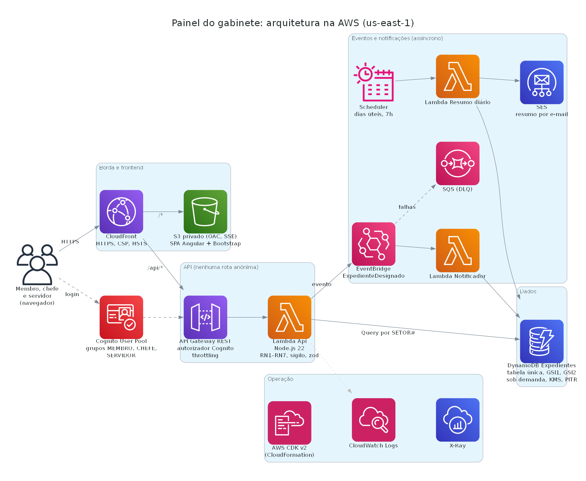
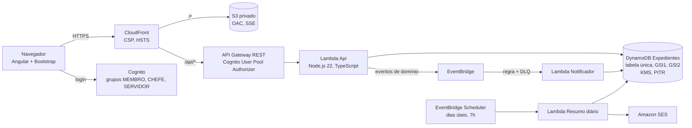

# Painel do gabinete: expedientes judiciais num só lugar

Hackathon MPF & AWS 2026 · caso SUBGTU · **dados 100% sintéticos**

No Único, os expedientes de um gabinete ficam em três gerenciadores (Judicial, Documento e Extrajudicial), cada um com
caixas e contadores próprios. Para saber o que vence hoje e o que é urgente, a equipe abre as três telas e monta a
prioridade de cabeça. Este MVP junta tudo numa lista ordenada por prazo e prioridade, explica por que cada processo
está no topo, permite agir em lote e abre o dia com uma tela inicial de contadores e alertas.

## Acesse a aplicação

<p>
  <a href="https://d3ruzott08qnzm.cloudfront.net">
    
  </a>
</p>

Aponte a câmera do celular para o QR code ou abra <https://d3ruzott08qnzm.cloudfront.net>. O acesso exige login com um
dos usuários fictícios de demonstração (peça a senha à equipe).

Kit do caso (requisitos, dicionário de dados e seed): [`docs/hackathon-expedientes/`](docs/hackathon-expedientes/).
Spec do Kiro: [`.kiro/specs/painel-expedientes/`](.kiro/specs/painel-expedientes/) (requisitos, design e tarefas).
Protótipos visuais estáticos (HTML, sem API e sem RN6; a IA da opção 2 é simulada):
[`docs/prototipos/`](docs/prototipos/).

## Arquitetura



Diagrama gerado a partir de código por [`docs/arquitetura/gerar_diagrama.py`](docs/arquitetura/gerar_diagrama.py)
(biblioteca `diagrams` + Graphviz). Versão em texto:



- **Serverless de ponta a ponta**, tudo em **AWS CDK v2** ([`infra/`](infra/)): nada criado no console.
- **Tabela única** exatamente como no `itens.json` do kit: painel pelo GSI1 (`SETOR#…` / `ATIVO#…`), fila pelo GSI2
  (`PRAZO#<data>#<100-pontos>`), detalhe numa só Query (`EXP#<id>`). Nenhum `Scan` no caminho da requisição.
- **Orientado a eventos:** designar publica `ExpedienteDesignado`; o notificador gera o alerta fora da requisição, com
  novas tentativas e fila de mensagens mortas. O resumo diário sai por EventBridge Scheduler + SES.
- **Camadas:** regras puras em `backend/src/dominio` (testadas), acesso a dados em `backend/src/dados`, handlers finos em
  `backend/src/api`. O mesmo roteador roda na Lambda e no servidor local.

## O que o MVP faz

| Requisito | Onde |
| --- | --- |
| RF01, RF02 painel unificado ou por gerenciador, caixas com contador (sem baixados, RN7) | Expedientes |
| RF03 busca e filtros avançados (prazo, prioridade, responsável, assunto, classe, tema, marcador, datas, sinalizações, risco) | Expedientes |
| RF04, RF05 filtros salvos (padrão, compartilhados), colunas, ordem, densidade, itens por página | Expedientes |
| RF06, RF07 fila por prazo e prioridade (RN1–RN3), selos com texto, "por que esta prioridade" | Expedientes, detalhe, foco |
| RF08 risco de vencimento, filtro e ordenação | Expedientes, detalhe |
| RF09 próximo processo, um por vez, atalhos N, P, A, X | Próximo processo |
| RF10 prazos em `.ics` com lembrete | Expedientes |
| RF11, RF12 receber, designar, marcador, ciência, assinar, movimentar e arquivar em lote, com prévia, motivo dos ignorados (RN4, RN5) e desfazer | Expedientes, detalhe, Lotes |
| RF13 histórico com filtro por tipo e CSV | Detalhe |
| RF14 sugestão por carga e distribuição equilibrada | Diálogo de designação |
| RF15, RF16 central de alertas e resumo diário por e-mail (prévia na tela) | Alertas |
| RF17 indicadores com tabela alternativa; produtividade só para membro e chefe | Indicadores |
| RF18, RF19 tela inicial com contadores clicáveis, próximos prazos, alertas, informes; widgets configuráveis | Início |

## Rodar localmente

Pré-requisito: Node.js 22.22.3 ou superior (exigência do Angular CLI 22.2). Com um Node mais antigo, gere o build do
frontend com `npx -y -p node@22 -- node node_modules/@angular/cli/bin/ng.js build`. O servidor local carrega o `itens.json` do kit numa tabela em memória (mesma
semântica de chaves do DynamoDB) e usa a data de referência da base, 07/10/2026 17h.

```bash
cd backend && npm ci && npm start          # API em http://127.0.0.1:3000/api
cd frontend && npm ci && npm start         # SPA em http://localhost:4200 (proxy para a API)
```

Ou publique o build pelo próprio servidor local: `cd frontend && npm run build`, depois `cd backend && npm start` e abra
<http://127.0.0.1:3000>. No modo local, o login é um seletor de usuário fictício (sem senha) com token HMAC assinado.

### Roteiro da demonstração (5 min)

1. Entre como **Bruno Teste (chefe)**. A tela inicial abre nos contadores judiciais: 4 vencidos, 5 vencem hoje, 17 a
   receber. Clique em "Vencidos": o painel abre filtrado.
2. No painel, mostre os selos (texto + cor), a ordem da fila e um filtro avançado. Salve o filtro e compartilhe.
3. Caixa "A receber": marque dois processos, **Receber**, veja a prévia, confirme e **desfaça**.
4. Caixa "No setor": marque três, **Designar** → "Distribuir de forma equilibrada". A tabela de carga explica a escolha.
5. Abra um processo: composição da prioridade, risco, prazos, designações e histórico (filtre e exporte CSV).
6. **Próximo processo**: navegue com N e P.
7. Saia e entre como **Carla Modelo (servidora)**: filtre "Sigiloso" e veja o conteúdo restrito; tente abrir
   `/expedientes/EXP003000` (outro setor) e veja o acesso negado.

| Perfil | Usuário fictício | E-mail (Cognito) |
| --- | --- | --- |
| MEMBRO | Ana Exemplo | `usuario01@exemplo.org` |
| CHEFE | Bruno Teste | `usuario02@exemplo.org` |
| SERVIDOR | Carla Modelo | `usuario03@exemplo.org` |

## Testes

```bash
cd backend && npm test        # Vitest: regras RN1–RN7, lote, sigilo, eventos e API sobre a base completa
cd infra && npm test          # template: nenhum método anônimo, IAM sem "*", KMS, HTTPS, eventos
cd frontend && npm test       # selos, contraste, filtros, ações por perfil, interceptor
```

Os testes de API cobrem 401, 403 de outro setor e de claims divergentes, máscara de sigilo em lista, detalhe, CSV,
histórico e `.ics`, contadores iguais aos de `contadores.csv` e lote de ponta a ponta com desfazer. O roteiro acima foi
executado em Chromium com axe-core (WCAG 2.1 A/AA) em todas as telas, em 1366 px e em 390 px, sem violações. A
validação completa de acessibilidade ainda depende de teste manual com leitor de tela.

## Publicar na AWS

Use sempre o perfil `hackathon` (conta do evento 698271685662, `us-east-1`), nunca o `default`. Publique só pelos
scripts `npm run bootstrap`, `npm run synth` e `npm run deploy`, que já passam `--profile hackathon`. A conta está fixa
em `infra/bin/app.ts`: com credenciais de outra conta, o deploy falha em vez de publicar no lugar errado.

Ordem: bootstrap do CDK (uma vez por conta) → build do frontend → deploy (a pilha cria a tabela `Expedientes`) →
carga do seed **sem** `--criar-tabela` (senão falha com `ResourceInUseException`) → usuários no Cognito.

Bash (Linux, macOS, Git Bash):

```bash
# Na raiz do repositório
(cd backend && npm ci)
(cd frontend && npm ci && npm run build)                  # o CDK publica o build no S3
(cd infra && npm ci && npm run bootstrap)                 # só na primeira vez na conta
(cd infra && npm run synth && npm run deploy)             # synth antes de todo deploy

# Carga do seed na tabela criada pela pilha (sem --criar-tabela)
AWS_PROFILE=hackathon uv run --no-project --with boto3 python docs/hackathon-expedientes/seed/gerar_seed.py \
  --carregar --tabela Expedientes --regiao us-east-1

# Usuários fictícios no Cognito (a senha fica só no terminal)
(cd infra && USER_POOL_ID=<saída UserPoolId> SENHA_DEMO='<12+ caracteres>' npm run usuarios)
```

PowerShell (Windows):

```powershell
# Na raiz do repositório
npm ci --prefix backend
npm ci --prefix frontend; npm run build --prefix frontend
npm ci --prefix infra; npm run bootstrap --prefix infra    # bootstrap só na primeira vez
npm run synth --prefix infra; npm run deploy --prefix infra

# Carga do seed (sem --criar-tabela)
$env:AWS_PROFILE = 'hackathon'
uv run --no-project --with boto3 python docs/hackathon-expedientes/seed/gerar_seed.py --carregar --tabela Expedientes --regiao us-east-1

# Usuários fictícios no Cognito
$env:USER_POOL_ID = '<saída UserPoolId>'
$env:SENHA_DEMO = Read-Host 'Senha de demonstração (12+ caracteres)'
npm run usuarios --prefix infra    # usa o perfil hackathon por padrão
Remove-Item Env:SENHA_DEMO
```

Se um antivírus interceptar o HTTPS e o npm, o CDK ou o boto3 falharem com erro de certificado, aponte
`NODE_EXTRA_CA_CERTS` e `AWS_CA_BUNDLE` para um arquivo PEM com as CAs raiz da máquina.

A saída `Url` da pilha é o endereço da aplicação. Para o resumo diário, passe `-c remetente=<e-mail verificado no SES>`
e, com o SES em sandbox, `-c destinatarioDemo=<e-mail verificado>`. Para limpar: `npm run destroy` (todos os recursos
usam `RemovalPolicy.DESTROY`).

## Segurança e LGPD

- **Nenhum endpoint anônimo.** O API Gateway valida o ID token do Cognito; a Lambda lê `custom:idUsuario`,
  `custom:siglaSetor` (imutáveis, não graváveis pelo cliente) e o grupo, e confere com o cadastro.
- **Autorização no backend:** toda consulta usa `SETOR#<sigla>` do usuário; outro setor → 403. Em sigiloso, servidor só
  vê conteúdo se for o responsável (RN6). A máscara é aplicada antes dos filtros, para o filtro não revelar o
  conteúdo. CSV, histórico, `.ics` e e-mail **nunca** levam conteúdo de sigiloso, qualquer que seja o perfil.
- **Entradas validadas com zod**, limites de lote (200) e de página (100), corpo até 100 KB, Query parametrizada.
  CSV protegido contra injeção de fórmula.
- **Menor privilégio:** uma role por Lambda, com permissões restritas à tabela, aos índices, ao barramento e às
  identidades SES; teste automatizado garante ausência de `*` em ações. Próximo passo: trocar os `grant*Data` por
  políticas só com as ações usadas (sem `Scan`, `DeleteItem`, `BatchWriteItem`).
- **Criptografia:** DynamoDB com KMS (chave gerenciada pela AWS, `aws/dynamodb`) e PITR; S3 privado (OAC, SSE, só HTTPS); CloudFront com CSP, HSTS e
  `X-Frame-Options`.
- **Logs** estruturados sem corpo de requisição nem conteúdo de expediente; log de acesso da API sem query string.
- **LGPD:** só dados sintéticos do kit; eventos e e-mails levam o mínimo (etiquetas e números); sessão em
  `sessionStorage`; nenhuma credencial no repositório.

## Custo estimado

Estimativa de ordem de grandeza para um gabinete (cerca de 10 usuários e 2 mil leituras de painel por dia), em
us-east-1, com preços sob demanda. Confirme no AWS Pricing Calculator antes de qualquer decisão.

| Serviço | Uso mensal aproximado | Custo aproximado |
| --- | --- | --- |
| DynamoDB sob demanda | ~40 MB, ~40 milhões de unidades de leitura | US$ 5 a 10 |
| Lambda | ~100 mil invocações de 300 ms, 1 GB | < US$ 2 |
| API Gateway REST | ~100 mil requisições | < US$ 1 |
| CloudFront + S3 | poucos GB | < US$ 1 |
| Cognito, EventBridge, SES | dentro das faixas iniciais | ~US$ 0 |

O custo dominante é a leitura do painel (o setor inteiro por consulta). O próximo passo de otimização é projetar no
GSI1 só as colunas da lista ou guardar os ativos do setor em cache.

## Do MVP à produção

- Integração com o Único (eventos de entrada e saída de expedientes) no lugar da carga do seed.
- Autenticação federada com o provedor do MPF (SAML/OIDC no Cognito) e políticas no Amazon Verified Permissions.
- Auditoria (trilha de quem viu o quê em sigilosos), CloudWatch dashboards e alarmes, WAF no CloudFront.
- Paginação por chave e projeções no GSI para setores com dezenas de milhares de expedientes.
- Bedrock para resumo do dia em linguagem natural e busca em linguagem natural convertida em filtros, sem enviar
  conteúdo sigiloso.
- Teste com leitor de tela e com usuários dos três perfis.

**Reuso:** o modelo e o código não dependem do gabinete; qualquer setor do Único (ou outro órgão com caixas e prazos)
usa o mesmo painel trocando a carga de dados.

## Uso do Kiro

- **Spec:** requisitos (EARS), design e tarefas em [`.kiro/specs/painel-expedientes/`](.kiro/specs/painel-expedientes/).
- **Steering:** produto, tecnologia e critérios de avaliação em [`.kiro/steering/`](.kiro/steering/).
- **Hooks:** [`.kiro/hooks/`](.kiro/hooks/) roda typecheck e testes do backend ao salvar e pede revisão das regras de
  sigilo e acesso quando código sensível muda.
